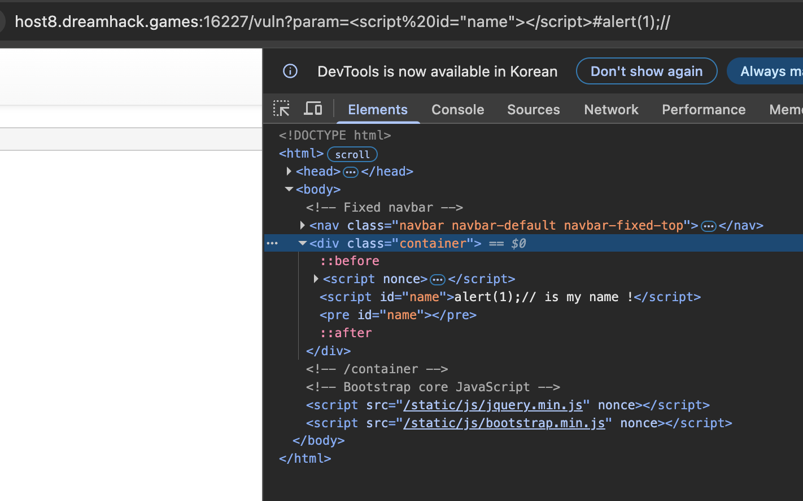

# Challenge: dreamhack - DOM-XSS

## 문제 설명 & 접근
https://dreamhack.io/wargame/challenges/438/


## 문제 풀이
step 1
* app.py에서 CSP 조건부터 보자. script-src 'self' 'nonce-{nonce}' 'strict-dynamic'이 설정되어 있다. 여기서 strict-dynamic은 신뢰된(nonce나 해시가 붙어있는) script가 동적으로 ```<script>``` 태그를 만들어 외부/내부 JS를 추가하면, 그 추가된 script도 신뢰하겠다는 것이다. 
    ```python
    @app.after_request
    def add_header(response):
        global nonce
        response.headers['Content-Security-Policy'] = f"default-src 'self'; img-src https://dreamhack.io; style-src 'self' 'unsafe-inline'; script-src 'self' 'nonce-{nonce}' 'strict-dynamic'"
        nonce = os.urandom(16).hex()
        return response
    ```

* 플래그를 얻기 위해서는 /flag 페이지의 폼에 param과 name을 잘 입력해 document.cookie를 얻어내야 한다.

step 2
* vuln.html을 분석해보자. 
    ```html
    
    Index

    
    {{ super() }}
    <style type="text/css">
        .important { color: #336699; }
    </style>
    

    

    <script nonce={{ nonce }}>
        window.addEventListener("load", function() {
        var name_elem = document.getElementById("name");
        name_elem.innerHTML = `${location.hash.slice(1)} is my name !`;
        });
    </script>
    {{ param | safe }}
    <pre id="name"></pre>
    
    ```
    * 우선 {{ param | safe }}로 safe가 설정되어 있다. 따라서 HTML, JS 코드가 그대로 랜더링되는 것을 알 수 있다. ```param=<script id="name"></script>```를 집어넣으면 그대로 페이지에 포함되는 것이다. 즉, 빈 ```<script>``` 태그가 id="name"으로 생성된다.
    * location.hash.slice(1)은 # 뒤 문자열을 반환한다. 즉, /vuln?param=<script id="name"></script>#alert(1);//를 입력한다면? "alert(1);//" 문자열이 innerHTML로 들어가는 것이다.
    * 즉, 공격은 param에 id가 "name"인 script를 삽입하고, innerHTML로 악성 페이로드가 들어가게 한다면 공격을 수행할 수 있다. id가 "name"인 script를 넣으면 id 값이 "name"인 값이 두 개가 되므로 var name_elem = document.getElementById("name");에서 먼저 등장하는 요소인 스크립트 요소가 반환된다. 그리고 innerHTML이 실행되면서 아래 사진과 같이 반영되면서 alert가 발생한다. 


Step 3
* 이제 페이로드를 작성하자. <script id="name"></script>#location.href='/memo?memo='.concat(document.cookie);// 와 같이 입력해주면 플래그를 얻을 수 있다.


## 결과
위 페이로드를 입력하고 /memo 페이지에서 확인할 수 있다. 또는 /memo 대신 외부 주소를 사용해도 플래그를 얻을 수 있다. strict-dynamic으로 항상 신뢰받는 스크립트로 여겨지기 때문이다.


